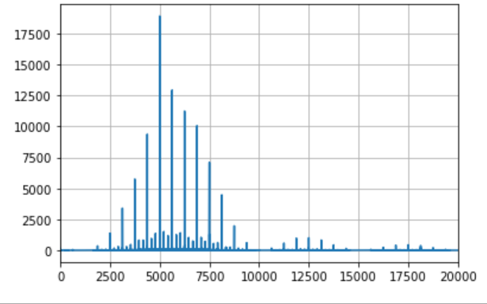

# Proyecto 4
Este proyecto consiste en la simulación de la transmisión de datos de una imagen de un punto a otro, pero, a través de un canal ruidoso
de modo que se podrá revisar, en el destino, los cambios que ha sufrido los datos dada la afectación de un medio ruidoso.

## Moduluación QPSK
Para esta sección, se crea un modulador que recibe los bits de la imagen, y crea dos portadoras; una portadora I y otra Q. Entonces, el modulador
asigna un bit a una portadora, y el siguiente a la otra, de forma que se pueda simular la modulación QPSK. A continuación se presenta el resultado
de la imagen y las diferencias entre las ondas.

### Curvas para el proceso con modulación QSPK (dos portadoras)
 

### Curvas para el proceso con modulación BSPK (una portadora)
 

### Imagen Transferida
 

## Estacionaridad y ergodicidad

Para esto, se edita el código del laboratorio 4, con el propósito de obtener el promedio temporal de la señal Tx; también, las variables aleatorias
son A1 y A2, las cuáles oscilan entre -1 y 1 de forma periódica, entonces se crea las variables aleatorias correspondientes. Los resultados son los
que siguen:

 

De la figura anterior se puede observar que el promedio temporal, o sea lineas y puntos rojos, es igual que el promedio estadístico, en colo azul. Este último son las variables aleatorias, es decir, las amplitudes que oscilan entre 1 y -1.

  * Como coinciden el promedio temporal y estadístico, se concluye que es un proceso ergódico.
  * Como el valor medio de la señal Tx es constante, entonces se puede deducir que se trata de un proceso estacionario.

## Densidad espectral de potencia

Para esto se sigue el procedimiento del video explicativo del proyecto. Se crea la correspondiente transformada de fourier; luego se grafica en el tiempo. Los resultados son los
que siguen:

  

